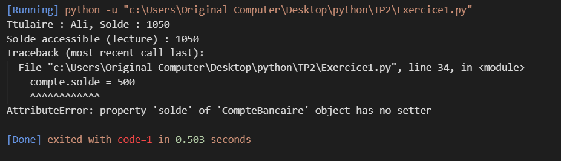

**TP 2 : Encapsulation**

**Exercice 1:**
**Objectif pédagogique*
Appliquer les principes d’encapsulation en Python : attributs protégés, privés, propriétés, validation des données, et séparation interface/interne.

**Exercice 2**
**Objectif pédagogique*
Mettre en œuvre l’association entre classes via la composition. Ce TP montre comment une classe peut utiliser une autre sans héritage, illustrant ainsi une relation de type « a un » ou « utilise ».

[Exercice 2](images/exercice2.png)
